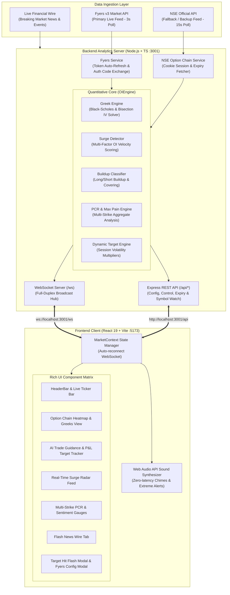

# ⚡ LIVE OPTIONS OI SURGE RADAR & INSTITUTIONAL ACTIVITY ENGINE
### High-Frequency Real-Time Derivatives Analytics, Institutional Surge Radar & AI Trade Guidance for Nifty, Bank Nifty & Major Nifty 50 Stocks

[](https://opensource.org/licenses/MIT)
[](https://nodejs.org/)
[](https://react.dev/)
[](https://www.typescriptlang.org/)
[](https://developer.mozilla.org/en-US/docs/Web/API/WebSocket)
[](https://fyers.in/)

---

## 📑 Table of Contents

1. [Executive Overview](#-executive-overview)
2. [Key Capabilities & Modules](#-key-capabilities--modules)
3. [Architecture & System Design](#-architecture--system-design)
4. [Mathematical & Quantitative Engines](#-mathematical--quantitative-engines)
   - [Real-Time Implied Volatility (IV) Inversion](#1-real-time-implied-volatility-iv-inversion)
   - [Black-Scholes Greek Engine & Theta Decay](#2-black-scholes-greek-engine--theta-decay)
   - [Multi-Factor OI Surge Scoring Model](#3-multi-factor-oi-surge-scoring-model)
   - [Institutional Buildup Classification Matrix](#4-institutional-buildup-classification-matrix)
   - [Dynamic Target & Adaptive Stoploss Algorithm](#5-dynamic-target--adaptive-stoploss-algorithm)
   - [Max Pain & Multi-Strike PCR Analysis](#6-max-pain--multi-strike-pcr-analysis)
5. [Supported Instruments & Underlying Universe](#-supported-instruments--underlying-universe)
6. [Fyers Broker Integration & Morning Workflow](#-fyers-broker-integration--morning-workflow)
7. [Installation & Local Setup](#-installation--local-setup)
8. [API & WebSocket Protocol Reference](#-api--websocket-protocol-reference)
9. [UI Component Breakdown](#-ui-component-breakdown)
10. [Audio Alert & Flash Signal Engine](#-audio-alert--flash-signal-engine)
11. [Project Directory Structure](#-project-directory-structure)
12. [Troubleshooting & FAQ](#-troubleshooting--faq)

---

## 🌟 Executive Overview

**Live Options OI Surge Radar** is an institutional-grade, real-time options analytics terminal tailored specifically for the Indian Derivatives Market (NSE). It continuously ingests tick-by-tick and sub-second option chain data from the **Fyers v3 REST & Streaming API** (with automated fallback to **NSE Official Data Pipelines**), crunching millions of open contracts to detect rapid institutional order flows, block accumulation, short squeezes, and trap breakouts.

Unlike static option chain viewers that only refresh every 3 minutes, this radar processes 1-minute and 5-minute rolling deltas, computes live **Black-Scholes Greeks (Theta, Delta, Gamma)**, solves **Implied Volatility (IV)** on every strike tick, calculates instantaneous **PCR shifts (Total PCR, ATM PCR, ATM±5, ATM±10)**, and projects high-probability **Scalp & Momentum Trade Setups** with real-time target hits and emergency stop-loss monitoring.

```
┌─────────────────────────────────────────────────────────────────────────────────┐
│                           LIVE OI SURGE RADAR ENGINE                            │
├───────────────────────────────┬─────────────────────────────────────────────────┤
│ 🟢 Institutional Buildup      │ Real-time Long Buildup / Short Squeeze Tracker  │
│ ⚡ Sub-Second Surge Radar     │ Multi-Factor Weighted Scoring (40/20/20/10/10)  │
│ 📊 Interactive Heatmap        │ 3D Strike Heatmaps with Bid/Ask Institutional OI│
│ 🎯 AI Trade Guidance Engine   │ Dynamic Risk:Reward, Multi-target Profit Scalps │
│ 🔔 Audio Alert Synthesizer    │ Zero-latency Web Audio API Audio Cues           │
│ 📰 Breaking News Wire         │ Flash Financial Market News & Regulatory Alerts │
└───────────────────────────────┴─────────────────────────────────────────────────┘
```

---

## 🚀 Key Capabilities & Modules

### 1. Ultra-Low Latency WebSocket Architecture
- High-performance Node.js / TypeScript WebSocket backend broadcasting snapshot diffs every **3 seconds** during market hours (09:15 – 15:40 IST).
- Sub-50ms React 19 client re-rendering with differential virtual DOM batching.

### 2. Multi-Factor Institutional OI Surge Detector
- Analyzes 5 distinct velocity metrics simultaneously:
  - **40% OI Velocity**: Normalized contract velocity against historical moving averages.
  - **20% Relative Volume**: Volume spikes exceeding baseline benchmark capacity.
  - **20% Premium Movement**: Price thrust validating smart money conviction.
  - **10% PCR Velocity**: 1-minute Put-Call Ratio inflection points.
  - **10% ATM Proximity**: Weighting factor rewarding near-the-money liquidity hubs.

### 3. Precision Black-Scholes Greeks & Exact IV Inversion
- Inverts the analytical Black-Scholes formula using a high-precision **Bisection Solver** to obtain exact strike-by-strike Implied Volatility ($IV\%$).
- Calculates continuous **Theta Decay** both in **₹/day** and **₹/trading hour** (6.4 trading hours/day), warning traders when decay risk turns **EXTREME**.

### 4. Interactive Live Option Chain Heatmap
- Visual color-coded gradients (Deep Cyan Calls vs Vivid Rose Puts).
- Real-time **Total OI**, **1m OI Delta**, **5m OI Delta**, **LTP**, **IV**, and **Theta/Hr**.
- Quick strike-range filtering ($\pm 5$ to $\pm 20$ strikes around ATM).

### 5. AI Trade Guidance & Real-Time Target Hit Alerts
- Automatic extraction of the best **Bullish (CE)** and **Bearish (PE)** trade setups.
- Computes dynamic Entry Band, Target ($+8\%$ to $+32\%$), and Stoploss ($-5\%$ to $-16\%$) based on time-of-day volatility decay.
- Automatically detects and triggers **Confetti Celebration Modals** upon Target 1 achievement and sounds instant audio warnings on stoploss breaches.

### 6. Zero Re-Login Persistent Fyers Authentication
- Saves encrypted session tokens in `server/fyersConfig.json`.
- 10-second single-click morning login using Fyers OAuth2 authorization code with client-side SHA-256 app secret hashing.

---

## 🏗 Architecture & System Design



---

## 📐 Mathematical & Quantitative Engines

### 1. Real-Time Implied Volatility (IV) Inversion

Standard Black-Scholes calculates price $C$ from volatility $\sigma$. In our system, the market provides $C_{market}$ (Last Traded Price) and we numerically invert for $\sigma_{implied}$:

$$d_1 = \frac{\ln(S / K) + (r + \frac{1}{2}\sigma^2)T}{\sigma \sqrt{T}}$$

$$d_2 = d_1 - \sigma \sqrt{T}$$

$$C_{BS}(S, K, T, r, \sigma) = S \cdot N(d_1) - K e^{-rT} N(d_2)$$

$$P_{BS}(S, K, T, r, \sigma) = K e^{-rT} N(-d_2) - S \cdot N(-d_1)$$

Where:
- $S$ = Spot Price of the Index / Stock
- $K$ = Strike Price
- $T$ = Time to expiry in years ($DTE / 365.0$)
- $r$ = Risk-free interest rate ($6.8\% = 0.068$)
- $N(x)$ = Cumulative standard normal distribution approximation

Our **Greek Engine** uses an accelerated **Bisection Iterative Numerical Root Finder** across $[0.03, 1.50]$ (3% to 150% IV) converging in fewer than 22 iterations with an error tolerance $\epsilon < 0.05$.

---

### 2. Black-Scholes Greek Engine & Theta Decay

Option Theta represents the rate of decay of option value with the passage of time:

**Call Theta ($\Theta_{Call}$):**
$$\Theta_{Call} = -\frac{S \cdot N'(d_1) \cdot \sigma}{2\sqrt{T}} - r \cdot K e^{-rT} N(d_2)$$

**Put Theta ($\Theta_{Put}$):**
$$\Theta_{Put} = -\frac{S \cdot N'(d_1) \cdot \sigma}{2\sqrt{T}} + r \cdot K e^{-rT} N(-d_2)$$

Our system translates annual theoretical theta into actionable trader metrics:
- **Daily Theta (₹/day)** = $\frac{\Theta_{Annual}}{365}$
- **Hourly Theta (₹/hr)** = $\frac{\Theta_{Daily}}{6.4}$ *(based on 6 hours 24 minutes of Indian market trading)*

---

### 3. Multi-Factor OI Surge Scoring Model

Every incoming tick across all monitored strikes is evaluated through a 5-dimension normalized scoring engine:

$$\text{Composite Score} = (0.40 \cdot S_{OI}) + (0.20 \cdot S_{Vol}) + (0.20 \cdot S_{Price}) + (0.10 \cdot S_{PCR}) + (0.10 \cdot S_{ATM})$$

| Factor | Weight | Evaluation Logic | Threshold Trigger |
| :--- | :---: | :--- | :--- |
| **OI Velocity ($S_{OI}$)** | **40%** | $\frac{|\Delta OI_{1m}|}{\text{Baseline OI}}$ scaled dynamically | Multiple $\ge 5\times \rightarrow 100$ pts |
| **Relative Volume ($S_{Vol}$)** | **20%** | $\frac{\text{Volume}_{current}}{\text{Baseline Vol}} \times 25$ | Spike $\ge 4\times \text{Avg} \rightarrow 100$ pts |
| **Premium Movement ($S_{Price}$)** | **20%** | $|\Delta \% LTP| \times 6.5$ | Shift $\ge 15.4\% \rightarrow 100$ pts |
| **PCR Velocity ($S_{PCR}$)** | **10%** | $|\Delta PCR_{1m}| \times 500$ | Shift $\ge 0.20 \rightarrow 100$ pts |
| **ATM Proximity ($S_{ATM}$)** | **10%** | $\max(5, 100 - (\text{Strike Distance Step} \times 15))$ | ATM = 100 pts, OTM-5 = 25 pts |

#### Classification Tiers:
- **EXTREME SURGE (Score $\ge 80$ or Multiple $\ge 5.0\times$)**: Triggers high-priority strobe banner & audio siren.
- **STRONG SURGE (Score $\ge 60$ or Multiple $\ge 3.0\times$)**: Triggers audio double-chime.
- **MODERATE SURGE (Score $\ge 35$ or Multiple $\ge 1.8\times$)**: Highlighted on the Radar Feed.

---

### 4. Institutional Buildup Classification Matrix

The relationship between Open Interest Delta ($\Delta OI$) and Price Delta ($\Delta P$) reveals the exact institutional intent:

```
                      PRICE DELTA (ΔP > 0)          PRICE DELTA (ΔP < 0)
                 ┌─────────────────────────────┬─────────────────────────────┐
                 │        LONG BUILDUP         │        SHORT BUILDUP        │
  OI DELTA       │  🟢 Aggressive Buyers       │  🔴 Heavy Sellers / Writers │
  (ΔOI > 0)      │  Institutions accumulating  │  Resistance / Call Walls    │
                 ├─────────────────────────────┼─────────────────────────────┤
                 │       SHORT COVERING        │       LONG UNWINDING        │
  OI DELTA       │  ⚡ Trapped Sellers Panicking│  ⚠️ Long Buyers Liquidating │
  (ΔOI < 0)      │  Explosive Upward Squeeze   │  Momentum Fading Downwards  │
                 └─────────────────────────────┴─────────────────────────────┘
```

---

### 5. Dynamic Target & Adaptive Stoploss Algorithm

Traditional fixed targets fail because option volatility varies dramatically throughout the trading day. Our engine applies **Session Time Multipliers** and **Moneyness Multipliers**:

$$\text{Target } \% = \text{clamp}\left(8\%, 32\%, 28\% \times M_{session} \times M_{moneyness}\right)$$
$$\text{Stoploss } \% = \text{clamp}\left(5\%, 16\%, \text{Target } \% \times 0.55\right)$$

#### Session Volatility Curve ($M_{session}$):
- **09:15 – 10:30 AM (Opening Rush)**: $M_{session} = 1.00$ (Full expansion targets)
- **10:30 AM – 01:00 PM (Midday Lull)**: $M_{session} = 0.70$ (Consolidation scalps)
- **01:00 PM – 02:30 PM (European Open)**: $M_{session} = 0.75$ (Moderate momentum)
- **02:30 PM – 03:30 PM (Closing Session)**: $M_{session} = 0.55$ (Quick scalps to avoid 0DTE theta crush)

---

### 6. Max Pain & Multi-Strike PCR Analysis

#### Max Pain Formula:
Max Pain is the strike price at which option buyers lose the maximum amount of money, and option writers (institutions) retain the maximum premium:

$$\text{Total Loss}(K_i) = \sum_{j} \text{CallOI}_j \cdot \max(0, K_i - K_j) + \sum_{j} \text{PutOI}_j \cdot \max(0, K_j - K_i)$$
$$\text{Max Pain Strike} = \arg\min_{K_i} \text{Total Loss}(K_i)$$

#### Multi-Tier PCR:
- **Total PCR**: $\frac{\sum \text{Put OI}}{\sum \text{Call OI}}$ (Broad market structural bias)
- **ATM PCR**: $\frac{\text{Put OI at ATM}}{\text{Call OI at ATM}}$ (Immediate intraday tug-of-war)
- **ATM±5 PCR**: Aggregated over the nearest 5 strikes.
- **ATM±10 PCR**: Aggregated over the nearest 10 strikes.

---

## 📊 Supported Instruments & Underlying Universe

The system natively supports all major Indian Benchmark Indices and high-beta Nifty 50 constituents:

| Category | Symbol | Lot Size | Strike Step | Default Range | Fyers Live Ticker |
| :--- | :--- | :---: | :---: | :---: | :--- |
| **BSE Benchmark Index** | `SENSEX` | 20 | 100 | $\pm 500$ pts | `BSE:SENSEX-INDEX` |
| **BSE Banking Index** | `BANKEX` | 30 | 100 | $\pm 500$ pts | `BSE:BANKEX-INDEX` |
| **NSE Benchmark Index** | `NIFTY` | 75 | 50 | $\pm 200$ pts | `NSE:NIFTY50-INDEX` |
| **NSE Banking Index** | `BANKNIFTY` | 30 | 100 | $\pm 500$ pts | `NSE:NIFTYBANK-INDEX` |
| **NSE Sector Index** | `FINNIFTY` | 65 | 50 | $\pm 200$ pts | `NSE:FINNIFTY-INDEX` |
| **NSE Midcap Index** | `MIDCPNIFTY` | 120 | 25 | $\pm 100$ pts | `NSE:MIDCPNIFTY-INDEX` |
| **NSE Index** | `NIFTYNXT50` | 25 | 100 | $\pm 400$ pts | `NSE:NIFTYNXT50-INDEX` |
| **Nifty 50 Heavyweight** | `RELIANCE` | 250 | 10 | $\pm 100$ pts | `NSE:RELIANCE-EQ` |
| **Nifty 50 Heavyweight** | `HDFCBANK` | 550 | 10 | $\pm 50$ pts | `NSE:HDFCBANK-EQ` |
| **Nifty 50 Heavyweight** | `ICICIBANK` | 700 | 10 | $\pm 50$ pts | `NSE:ICICIBANK-EQ` |
| **Nifty 50 Heavyweight** | `INFY` | 400 | 20 | $\pm 100$ pts | `NSE:INFY-EQ` |
| **Nifty 50 Heavyweight** | `TCS` | 175 | 50 | $\pm 150$ pts | `NSE:TCS-EQ` |

*New stocks can be dynamically added via the top Stock Selector or through `/api/symbol/watch`.*

---

## 🔑 Fyers Broker Integration & Morning Workflow

### Zero Re-Logins During the Trading Day
Once authenticated, the access token is cached in `server/fyersConfig.json`. Any tab reload, browser restart, or server reboot retains active live connection seamlessly.

### Quick 10-Second Morning Setup:
1. Open the application at [http://localhost:5173/](http://localhost:5173/).
2. Click **Connect Fyers** in the top navigation bar.
3. Click the blue **"Open Fyers Login Page"** button.
4. Log in with your Fyers PIN / OTP. You will be redirected to the success page.
5. Copy the `auth_code=` parameter from your browser's address bar.
6. Paste the code into the **"Auth Code"** box and click **Connect Fyers Account**.
7. The server generates the `SHA-256(AppID-100:SecretKey)` hash, exchanges the token, and begins real-time options data streaming immediately.

---

## 💻 Installation & Local Setup

### Prerequisites
- **Node.js**: v18.0.0 or higher
- **npm**: v9.0.0 or higher
- **Modern Web Browser**: Chrome, Edge, Brave, or Firefox

### Step 1: Clone or Open the Repository
```bash
cd d:/marketNifty
```

### Step 2: Install Dependencies
```bash
# Install root, backend and frontend dependencies
npm install
npm --prefix server install
npm --prefix client install
```

### Step 3: Run the Application Locally
You can run both client and server concurrently using the root scripts:

```bash
# Terminal 1: Start Backend API & WebSocket Server (Port 3001)
npm run dev:server

# Terminal 2: Start Frontend Client (Port 5173)
npm run dev:client
```

### Step 4: Access the Live Dashboard
Open your browser and navigate to:
```
http://localhost:5173/
```

---

## 📡 API & WebSocket Protocol Reference

### REST Endpoints (`http://localhost:3001`)

| Method | Endpoint | Description | Sample Response / Payload |
| :--- | :--- | :--- | :--- |
| `GET` | `/api/status` | Heartbeat, active connections & data source | `{"status":"ok","activeConnections":1,"dataSource":"FYERS_LIVE"}` |
| `GET` | `/api/symbols` | List of all configured indices & stocks | `[{"symbol":"NIFTY","step":50,"lot":75,...}]` |
| `POST` | `/api/symbol/watch` | Adds a symbol to active live polling | `{"symbol": "RELIANCE"}` |
| `GET` | `/api/news` | Recent breaking financial market headlines | `[{"id":"1","title":"RBI Policy Announcement",...}]` |
| `GET` | `/api/surges` | Recent institutional surge events list | `[{"id":"surge-1","surgeLevel":"EXTREME",...}]` |
| `POST` | `/api/datasource` | Toggle feed source (`FYERS_LIVE` / `NSE_LIVE`) | `{"mode": "FYERS_LIVE"}` |
| `POST` | `/api/fyers/connect` | Connect using App ID, Access Token & Secret | `{"appId":"KMSSMU...","accessToken":"eyJ..."}` |
| `POST` | `/api/fyers/exchange-authcode` | Exchange OAuth2 auth code for access token | `{"appId":"...","secretKey":"...","authCode":"..."}` |
| `POST` | `/api/expiry` | Set active expiry date for a symbol | `{"symbol":"NIFTY","expiry":"2026-09-03"}` |

### WebSocket Protocol (`ws://localhost:3001/ws`)

#### 1. `INITIAL_STATE` (Sent immediately upon connection)
```json
{
  "type": "INITIAL_STATE",
  "recentSurges": [...],
  "recentNews": [...],
  "dataSource": "FYERS_LIVE",
  "fyersConfig": { "appId": "...", "isConnected": true },
  "isMarketOpen": true,
  "timestamp": "2026-08-28T10:00:00.000Z"
}
```

#### 2. `INDEX_UPDATE` (Broadcast every 3 seconds)
```json
{
  "type": "INDEX_UPDATE",
  "symbol": "NIFTY",
  "indexState": {
    "symbol": "NIFTY",
    "spotPrice": 24538.20,
    "atmStrike": 24550,
    "pcr": { "totalPcr": 1.18, "atmPcr": 1.34, "sentiment": "BULLISH" },
    "maxPain": { "strike": 24500, "sentiment": "BULLISH" },
    "strikes": [...],
    "recommendedTrades": {
      "bullishPick": { "strike": 24550, "type": "CE", "recommendedEntry": "₹140.00", "target": "₹182.00", "stoploss": "₹118.00" },
      "bearishPick": { "strike": 24500, "type": "PE", "recommendedEntry": "₹120.00", "target": "₹156.00", "stoploss": "₹101.00" }
    }
  },
  "newSurges": [...]
}
```

#### 3. `FLASH_NEWS` (Broadcast instantly on breaking news)
```json
{
  "type": "FLASH_NEWS",
  "newsItem": {
    "id": "news-101",
    "title": "US Fed Signals Interest Rate Cut",
    "source": "Bloomberg",
    "sentiment": "BULLISH",
    "category": "MACRO"
  }
}
```

---

## 🎨 UI Component Breakdown

```
┌──────────────────────────────────────────────────────────────────────────────┐
│  HEADER BAR: Index Switcher | Live Ticker | Fyers Connect | Audio Toggle     │
├──────────────────────────────────────────────────────────────────────────────┤
│  BREAKING NEWS TICKER / FLASH NEWS ACCORDION                                 │
├──────────────────────────────────────────────────────────────────────────────┤
│  HIGHLIGHT SIGNAL BANNER: Instant Extreme Surge & Institutional Squeeze Cues │
├──────────────────────────────────────┬───────────────────────────────────────┤
│  LEFT COLUMN (65% Width)             │  RIGHT COLUMN (35% Width)             │
│  - Interactive Option Chain Heatmap  │  - AI Trade Guidance Cards (CE & PE)  │
│  - Live Strike Deltas (1m & 5m)      │  - Multi-Strike PCR & Sentiment Radial│
│  - Black-Scholes Theta Decay (₹/hr)  │  - Max Pain & Expected Expiry Pin     │
│  - Exact Strike Implied Volatility   │  - Real-Time Surge Radar Feed (Live)  │
│  - Strike Range Filter (±5 to ±20)   │  - Flash News Wire Terminal           │
├──────────────────────────────────────┴───────────────────────────────────────┤
│  DISCLAIMER TICKER: SEBI Regulatory Risk Disclosure (Options Trading Caution)│
└──────────────────────────────────────────────────────────────────────────────┘
```

---

## 🔔 Audio Alert & Flash Signal Engine

The client embeds an ultra-low latency **Web Audio API Synthesizer** requiring zero external MP3 downloads:

1. **Extreme Surge Siren (`playExtremeAlert`)**: High-intensity dual-tone frequency sweep (880 Hz to 1760 Hz) alerting traders of massive institutional block orders.
2. **Strong Surge Chime (`playStrongAlert`)**: Dual harmonic chord (523.25 Hz & 659.25 Hz) signaling momentum buildup.
3. **Target Hit Fanfare (`playTargetHitAlert`)**: Multi-stage arpeggio with celebratory canvas confetti explosion.
4. **Mute Control**: Instant toggle in the top bar with persisted local storage state.

---

## 📁 Project Directory Structure

```
marketNifty/
├── package.json               # Root scripts (dev:server, dev:client, build)
├── OI RADAR.txt               # Quick reference & setup notes
├── README.md                  # Master documentation (this file)
├── docs/                      # Dedicated deep technical documentation
│   ├── ARCHITECTURE.md        # Detailed backend & frontend system design
│   ├── TRADING_ENGINE_SPEC.md # Quantitative formulas & mathematical models
│   ├── API_REFERENCE.md       # Complete REST & WebSocket API specification
│   └── USER_MANUAL.md         # Trader quickstart & morning workflow guide
├── server/                    # Node.js + TypeScript Backend
│   ├── fyersConfig.json       # Persisted credentials & session token
│   ├── package.json           # Server dependencies (express, ws, cors, tsx)
│   ├── tsconfig.json          # TypeScript compiler configuration
│   └── src/
│       ├── index.ts           # Server entry point, REST routes & WS broadcast
│       ├── types.ts           # Shared TypeScript interfaces & types
│       ├── fyersAuth.ts       # Fyers OAuth2 token generator & SHA-256 hasher
│       ├── engine/
│       │   ├── oiEngine.ts    # Core snapshot processor, PCR & Max Pain engine
│       │   ├── greekEngine.ts # Black-Scholes Greeks & Bisection IV Inverter
│       │   ├── buildupClassifier.ts # Long/Short Buildup & Dynamic Targets
│       │   └── surgeDetector.ts # Multi-factor 5-dimension velocity scorer
│       └── services/
│           ├── fyersService.ts      # Fyers v3 API integration & option chain
│           ├── nseService.ts        # Official NSE fallback & cookie sessions
│           ├── nseExpiryService.ts  # Expiry date & DTE calculator
│           └── newsService.ts       # Real-time flash news broadcaster
└── client/                    # React 19 + TypeScript Frontend
    ├── index.html             # HTML5 template with Google Fonts (Inter)
    ├── package.json           # Client dependencies (React 19, Lucide, Tailwind)
    ├── vite.config.ts         # Vite bundler configuration
    ├── tailwind.config.js     # Dark theme colors & glassmorphism utilities
    └── src/
        ├── App.tsx            # Main dashboard container & grid layout
        ├── main.tsx           # React DOM root mounting
        ├── types.ts           # Frontend data structures & enum definitions
        ├── context/
        │   └── MarketContext.tsx # Central WebSocket state & action hub
        ├── utils/
        │   └── audioAlert.ts  # Web Audio API alert sound synthesizer
        └── components/
            ├── HeaderBar.tsx              # Top navigation bar & market status
            ├── HighlightSignalTicker.tsx  # Extreme surge banner & squeeze cues
            ├── OptionChainHeatmap.tsx     # Strike heatmap & Greeks table
            ├── TradeGuidanceCard.tsx      # AI trade setup, entry, SL & target
            ├── PcrGauges.tsx              # PCR radial gauges & sentiment meters
            ├── RadarFeed.tsx              # Live institutional surge stream
            ├── NewsWireTab.tsx            # Flash financial news wire
            ├── TargetHitFlashModal.tsx    # Confetti target hit celebration modal
            ├── SquareOffAlertBanner.tsx   # Emergency stoploss breach alert
            ├── FyersModal.tsx             # 10-second Fyers login & token modal
            └── DisclaimerTicker.tsx       # SEBI risk disclosure ticker
```

---

## 🛠 Troubleshooting & FAQ

### Q1: The dashboard shows "DISCONNECTED". How do I reconnect?
- Ensure the backend server is running on port `3001` (`npm --prefix server run dev`).
- Check your browser console to verify WebSocket connection to `ws://localhost:3001/ws`.
- The client automatically retries connecting every 2 seconds.

### Q2: Why are surges empty outside market hours?
- To prevent false alarms during market closure, institutional surges and trade signals are active between **09:15 AM and 03:40 PM IST (Mon-Fri)**. The option chain heatmap and latest closing state remain fully accessible 24/7.

### Q3: How do I switch between Fyers and NSE Fallback?
- Click the **Data Source** badge in the top navigation bar to toggle between `FYERS_LIVE` and `NSE_LIVE`.

---

## ⚖️ Regulatory Disclaimer

*Derivatives (Futures and Options) trading involves substantial risk of loss and is not suitable for every investor. The calculations, scores, signals, and suggested trades provided by this application are for analytical and educational purposes only. Always consult a SEBI registered investment advisor before executing live trades.*

---

**Built with precision for professional intraday traders.** 🚀
