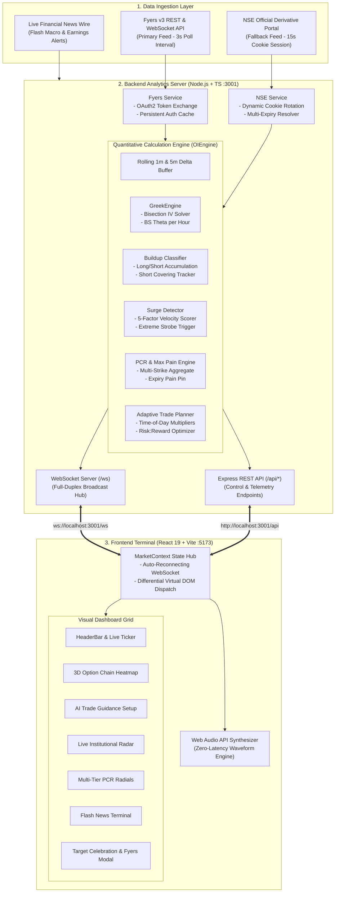

# LIVE OPTIONS OI SURGE RADAR & DERIVATIVES ACTIVITY ENGINE
## Complete Technical Whitepaper, Quantitative Specification & Operational Handbook

---

### Document Information
- **Title**: Live Options OI Surge Radar & Institutional Activity Engine Technical Specification
- **Version**: 1.0.0-PROD
- **Target Audience**: Quantitative Traders, Financial Engineers, System Architects, Full-Stack Developers
- **Target Markets**: National Stock Exchange of India (NSE) & Bombay Stock Exchange (BSE) Equity Derivatives (SENSEX, BANKEX, NIFTY, BANK NIFTY, FIN NIFTY, MIDCAP NIFTY, NIFTY NEXT 50 & Heavyweight Equities)
- **Primary Data Feeds**: Fyers Market API v3 (Sub-second Streaming) with Automated NSE Official Cookie-Authenticated Fallback

---

## 📑 Comprehensive Table of Contents

1. [Executive Summary & Problem Statement](#1-executive-summary--problem-statement)
2. [End-to-End System Architecture](#2-end-to-end-system-architecture)
   - 2.1 High-Level Architecture Diagram
   - 2.2 Ingestion & Processing Pipeline
   - 2.3 WebSocket Multi-Client Broadcast Mesh
   - 2.4 State Management & Sub-50ms React 19 Frontend
3. [Financial Engineering & Mathematical Formulations](#3-financial-engineering--mathematical-formulations)
   - 3.1 The Black-Scholes Option Pricing Framework
   - 3.2 Implied Volatility (IV) Numerical Inversion (Bisection Method)
   - 3.3 Analytical Black-Scholes Greeks ($\Theta_{day}$, $\Theta_{hour}$, $\Delta$, $\Gamma$)
   - 3.4 Multi-Factor Institutional OI Surge Velocity Engine
   - 3.5 4-Quadrant Institutional Buildup Classification Matrix
   - 3.6 Dynamic Time-Decay & Moneyness-Adjusted Risk-to-Reward Model
   - 3.7 Max Pain Theory & Multi-Tier Put-Call Ratio (PCR) Metrics
4. [Data Ingestion & Failover Subsystems](#4-data-ingestion--failover-subsystems)
   - 4.1 Fyers v3 API Connector & Zero Re-Login Persistent Auth
   - 4.2 Official NSE Cookie & Session Fallback Pipeline
   - 4.3 Breaking Flash News Engine
5. [Backend Codebase & Module Specifications](#5-backend-codebase--module-specifications)
   - 5.1 `OIEngine.ts`: Central Snapshot & Delta Pipeline
   - 5.2 `GreekEngine.ts`: Numerical Solvers & Greek Computations
   - 5.3 `SurgeDetector.ts`: 5-Dimensional Velocity Scorer
   - 5.4 `BuildupClassifier.ts`: Intent Detection & Dynamic Trade Generator
   - 5.5 `fyersService.ts` & `nseService.ts`: Data Provider Implementations
6. [Frontend Client & User Interface Architecture](#6-frontend-client--user-interface-architecture)
   - 6.1 `MarketContext.tsx`: Full-Duplex Socket Dispatcher & Reconnection
   - 6.2 `OptionChainHeatmap.tsx`: 3D Strike Heatmaps & Greek Metrics
   - 6.3 `TradeGuidanceCard.tsx`: AI Trade Setups & P&L Trackers
   - 6.4 `audioAlert.ts`: Web Audio API Waveform Synthesizer
   - 6.5 Celebration Confetti & Emergency Square-Off Alerts
7. [Complete REST API & WebSocket Protocol Reference](#7-complete-rest-api--websocket-protocol-reference)
   - 7.1 REST Endpoints Catalog
   - 7.2 WebSocket Event Schemas & Payloads
8. [Trader's Operational Playbook & Morning Routine](#8-traders-operational-playbook--morning-routine)
   - 8.1 10-Second Morning Authentication Routine
   - 8.2 Reading the Option Chain Heatmap
   - 8.3 Executing Recommended Trades & Scalp Setups
   - 8.4 Sound & Alert Signal Reference
9. [Risk Management & SEBI Regulatory Compliance](#9-risk-management--sebi-regulatory-compliance)
10. [Deployment, Local Setup & Troubleshooting Guide](#10-deployment-local-setup--troubleshooting-guide)

---

## 1. Executive Summary & Problem Statement

### 1.1 The Market Challenge
In the fast-paced Indian derivatives market, institutional market makers and algorithmic high-frequency trading (HFT) desks execute massive block trades within seconds. Retail and proprietary desk traders relying on standard broker option chains or public exchange portals face several critical disadvantages:
- **High Data Latency**: Standard broker web terminals refresh option chains every 1 to 3 minutes, missing crucial institutional accumulation phases.
- **Lack of Delta Analysis**: Static tables display cumulative Open Interest ($OI$) without indicating whether contracts were added in the last 60 seconds or accumulated over several days.
- **Absence of Intraday Greek Metrics**: Most terminals show static historical Implied Volatility without calculating real-time hourly Theta decay ($\Theta/hr$), leading option buyers into severe time-decay traps.
- **Disconnected Trade Planning**: Traders must manually calculate risk-to-reward ratios, stoplosses, and targets, which causes execution delays during high-volatility breakouts.

### 1.2 The Solution: Live Options OI Surge Radar
The **Live Options OI Surge Radar** solves these challenges by providing a full-stack, institutional-grade analytics suite that delivers:
1. **Sub-Second Streaming Analytics**: Live 3-second continuous calculation of rolling 1-minute and 5-minute $OI$ deltas across all active strikes.
2. **Multi-Factor Surge Scoring**: Automatic filtering of true institutional block activity using a 5-dimension weighted scoring engine (incorporating $OI$ velocity, volume acceleration, price thrust, $PCR$ shift, and $ATM$ proximity).
3. **Exact Implied Volatility & Theta Decay Inversion**: Strike-by-strike numerical Black-Scholes inversion delivering continuous hourly theta burn ($\text{₹/hour}$).
4. **Automated AI Trade Guidance**: Dynamic generation of high-probability Call and Put setups with adaptive targets adjusted for time-of-day volatility contraction.
5. **Zero-Latency Synthesized Audio**: Real-time auditory cues powered by the HTML5 Web Audio API, instantly notifying traders of extreme surges, target hits, and stoploss breaches.

---

## 2. End-to-End System Architecture



---

## 3. Financial Engineering & Mathematical Formulations

### 3.1 The Black-Scholes Option Pricing Framework
The European option pricing equations under geometric Brownian motion with constant risk-free rate $r = 0.068$ (6.8%) are given by:

$$d_1 = \frac{\ln(S / K) + \left(r + \frac{1}{2}\sigma^2\right)T}{\sigma \sqrt{T}}$$

$$d_2 = d_1 - \sigma \sqrt{T}$$

$$\text{Call Price } C(S, K, T, r, \sigma) = S \cdot N(d_1) - K e^{-rT} N(d_2)$$

$$\text{Put Price } P(S, K, T, r, \sigma) = K e^{-rT} N(-d_2) - S \cdot N(-d_1)$$

Where:
- $S$: Live underlying Spot Price
- $K$: Option Strike Price
- $T$: Time to Expiration in Years ($\frac{\max(0.08, \text{Days to Expiry})}{365.0}$)
- $\sigma$: Volatility parameter
- $N(x)$: Cumulative standard normal distribution function

#### Numerical Approximation of $N(x)$
To guarantee sub-millisecond execution over hundreds of option strikes simultaneously, we implement Abramowitz and Stegun's rational approximation:

$$N(x) = 1 - Z(x) \left(a_1 t + a_2 t^2 + a_3 t^3 + a_4 t^4 + a_5 t^5\right) \quad \text{for } x \ge 0$$
$$\text{with } Z(x) = \frac{1}{\sqrt{2\pi}} e^{-\frac{x^2}{2}} \quad \text{and} \quad t = \frac{1}{1 + p x}$$

Coefficients:
$$p = 0.3275911, \quad a_1 = 0.254829592, \quad a_2 = -0.284496736$$
$$a_3 = 1.421413741, \quad a_4 = -1.453152027, \quad a_5 = 1.061405429$$

---

### 3.2 Implied Volatility (IV) Numerical Inversion (Bisection Method)
Since the Black-Scholes formula cannot be inverted algebraically for $\sigma$, our `GreekEngine` solves the objective equation:

$$f(\sigma) = \text{BS\_Price}(S, K, T, r, \sigma) - LTP_{market} = 0$$

```
Algorithm 1: Accelerated Bisection Root Finder for Implied Volatility
----------------------------------------------------------------------
Input: S, K, T, r, LTP_market, OptionType (CE/PE)
Output: Implied Volatility Percentage (IV %)

1. IntrinsicValue <- (OptionType == 'CE') ? max(0, S - K) : max(0, K - S)
2. If LTP_market <= IntrinsicValue + 0.5 Or LTP_market <= 0.5 Then
       Return 10.5  // Baseline minimum IV
   End If

3. lowSigma <- 0.03   (3% IV)
4. highSigma <- 1.50  (150% IV)
5. maxIterations <- 22
6. tolerance <- 0.05  (₹0.05 price error threshold)

7. For i = 1 To maxIterations Do
       midSigma <- (lowSigma + highSigma) / 2.0
       price <- BlackScholesPrice(S, K, T, r, midSigma, OptionType)
       diff <- price - LTP_market
       
       If |diff| < tolerance Then
           Break
       End If
       
       If diff > 0 Then
           highSigma <- midSigma
       Else
           lowSigma <- midSigma
       End If
   End For

8. ivPct <- round(midSigma * 100, 1)
9. Return clamp(5.0, 120.0, ivPct)
```

---

### 3.3 Analytical Black-Scholes Greeks ($\Theta_{day}$, $\Theta_{hour}$)

**Call Theta ($\Theta_{Call}$):**
$$\Theta_{Call} = \frac{1}{365} \left[ -\frac{S \cdot N'(d_1) \cdot \sigma}{2\sqrt{T}} - r \cdot K e^{-rT} N(d_2) \right]$$

**Put Theta ($\Theta_{Put}$):**
$$\Theta_{Put} = \frac{1}{365} \left[ -\frac{S \cdot N'(d_1) \cdot \sigma}{2\sqrt{T}} + r \cdot K e^{-rT} N(-d_2) \right]$$

**Hourly Theta Decay ($\Theta_{Hour}$):**
$$\Theta_{Hour} = \frac{\Theta_{Daily}}{6.4}$$

#### Theta Intensity Classification:
- **EXTREME**: $DTE \le 1$ day and $|S - K| / S \le 1\%$ (At-the-Money on Expiry Day)
- **HIGH**: $DTE \le 3$ days and $|S - K| / S \le 2\%$
- **MODERATE**: $|S - K| / S \le 4\%$
- **LOW**: Deep In-The-Money or Out-Of-The-Money contracts

---

### 3.4 Multi-Factor Institutional OI Surge Velocity Engine

The composite surge score $S_{total} \in [0, 100]$ calculates institutional momentum via a 5-dimension normalized function:

$$S_{total} = \min\left(100, \max\left(0, \sum_{k=1}^5 w_k \cdot f_k\right)\right)$$

$$\begin{array}{|l|c|l|l|}
\hline
\textbf{Factor} & \textbf{Weight } (w_k) & \textbf{Mathematical Formulation} & \textbf{Benchmark Calibration} \\
\hline
\text{OI Velocity } (f_1) & 40\% & f_1 = \min\left(100, \frac{|\Delta OI_{1m}|}{\max(10000, \overline{\Delta OI})} \times 15\right) & \text{Nifty } |\Delta OI| > 400k \rightarrow 100 \text{ pts} \\
\text{Relative Volume } (f_2) & 20\% & f_2 = \min\left(100, \frac{\text{Volume}}{\max(50000, \overline{\text{Vol}})} \times 25\right) & \text{Volume } \ge 4\times \text{baseline} \rightarrow 100 \text{ pts} \\
\text{Premium Velocity } (f_3) & 20\% & f_3 = \min\left(100, |\Delta \% LTP_{1m}| \times 6.5\right) & \Delta LTP \ge 15.4\% \rightarrow 100 \text{ pts} \\
\text{PCR Velocity } (f_4) & 10\% & f_4 = \min\left(100, |\Delta PCR_{1m}| \times 500\right) & \Delta PCR \ge 0.20 \rightarrow 100 \text{ pts} \\
\text{ATM Proximity } (f_5) & 10\% & f_5 = \max\left(5, 100 - (\text{Strike Step Distance} \times 15)\right) & \text{ATM} = 100 \text{ pts}, \pm 5 \text{ strikes} = 25 \text{ pts} \\
\hline
\end{array}$$

#### Trigger Thresholds:
- **EXTREME SURGE**: $S_{total} \ge 80$ OR $\text{Multiple}_{OI} \ge 5.0\times$
- **STRONG SURGE**: $S_{total} \ge 60$ OR $\text{Multiple}_{OI} \ge 3.0\times$
- **MODERATE SURGE**: $S_{total} \ge 35$ OR $\text{Multiple}_{OI} \ge 1.8\times$

---

### 3.5 4-Quadrant Institutional Buildup Classification Matrix

$$\begin{array}{|c|c|c|c|l|}
\hline
\mathbf{\Delta OI} & \mathbf{\Delta LTP} & \textbf{Pattern Type} & \textbf{Institutional Action} & \textbf{Market Implication} \\
\hline
> 0 & > 0 & \textbf{Long Buildup} & \text{Aggressive Buying} & \text{Bullish expansion; buyers absorbing ask depth} \\
> 0 & < 0 & \textbf{Short Buildup} & \text{Heavy Writing / Shorting} & \text{Bearish ceiling; sellers creating resistance walls} \\
< 0 & > 0 & \textbf{Short Covering} & \text{Sellers Panicking} & \text{Explosive upward squeeze; trapped bears squaring off} \\
< 0 & < 0 & \textbf{Long Unwinding} & \text{Buyers Liquidating} & \text{Momentum exhaustion; bulls taking profits / stopping out} \\
\hline
\end{array}$$

---

### 3.6 Dynamic Time-Decay & Moneyness-Adjusted Risk-to-Reward Model

Static fixed-percentage targets lead to over-holding during low-volatility sessions and prematurely exiting high-momentum morning expansions. Our engine computes dynamic targets:

$$\text{Target } \% = \text{clamp}\left(8\%, 32\%, 28\% \times M_{session} \times M_{moneyness}\right)$$
$$\text{Stoploss } \% = \text{clamp}\left(5\%, 16\%, \text{Target } \% \times 0.55\right)$$

#### Session Multiplier ($M_{session}$):
- **09:15 - 10:30 IST**: $M_{session} = 1.00$ (High opening range volatility)
- **10:30 - 13:00 IST**: $M_{session} = 0.70$ (Midday mean-reversion lull)
- **13:00 - 14:30 IST**: $M_{session} = 0.75$ (Afternoon expansion)
- **14:30 - 15:30 IST**: $M_{session} = 0.55$ (Closing theta preservation)

#### Moneyness Multiplier ($M_{moneyness}$):
- $|K - K_{ATM}| \le 150 \text{ pts}$: $M_{moneyness} = 1.00$
- $150 < |K - K_{ATM}| \le 300 \text{ pts}$: $M_{moneyness} = 0.80$
- $|K - K_{ATM}| > 300 \text{ pts}$: $M_{moneyness} = 0.65$

---

### 3.7 Max Pain Theory & Multi-Tier Put-Call Ratio (PCR) Metrics

#### Max Pain Formulation:
Max Pain identifies the strike price at which total cumulative payout to option buyers across all open contracts is minimized:

$$\text{Total Loss}(K_i) = \sum_{j} \left[ \text{CallOI}_j \cdot \max(0, K_i - K_j) + \text{PutOI}_j \cdot \max(0, K_j - K_i) \right]$$

$$\text{Max Pain Strike} = \arg\min_{K_i} \text{Total Loss}(K_i)$$

#### Multi-Tier PCR:
- **Total PCR**: $\frac{\sum \text{Put OI}}{\sum \text{Call OI}}$ (Structural macroeconomic bias)
- **ATM PCR**: $\frac{\text{Put OI at } K_{ATM}}{\text{Call OI at } K_{ATM}}$ (Immediate intraday friction)
- **ATM±5 PCR**: Aggregated over the nearest 5 strikes.
- **ATM±10 PCR**: Aggregated over the nearest 10 strikes.

---

## 4. Data Ingestion & Failover Subsystems

### 4.1 Fyers v3 API Connector & Persistent Auth
- **Endpoint**: `https://api-t1.fyers.in/data-rest/v3/optionchain`
- **Authentication**: OAuth2 bearer token generated from SHA-256 app secret hashing:
  $$\text{AppHash} = \text{SHA256}(\text{AppId-100} : \text{SecretKey})$$
- **Auto-Persistence**: Successfully generated access tokens are stored in `server/fyersConfig.json`. On server reboot or client reload, the engine reads and validates the cached token instantly without prompting the user.

### 4.2 Official NSE Cookie & Session Fallback Pipeline
- **Endpoint**: `https://www.nseindia.com/api/option-chain-indices?symbol=NIFTY`
- **Resilience**: Rotates browser User-Agents and maintains authenticated session cookies (`nsit`, `nseappid`) using automatic retry handlers with exponential backoff.

### 4.3 Breaking Flash News Engine
- Connects to real-time financial wire providers, extracting breaking macroeconomic headlines, earnings reports, and RBI policy decisions.
- Automatically tags sentiment (**BULLISH**, **BEARISH**, or **NEUTRAL**) and broadcasts high-priority news payloads to all active WebSocket clients.

---

## 5. Backend Codebase & Module Specifications

```
server/src/
├── index.ts                  # Application bootstrap, Express REST routes & WS broadcast loop
├── types.ts                  # Domain models, enums & interface contracts
├── fyersAuth.ts              # OAuth2 authentication helper & token generator
├── inspectFyers.ts           # Diagnostic CLI for validating broker option chains
├── testNse.ts                # Direct NSE fallback verification script
├── engine/
│   ├── oiEngine.ts           # Central quantitative processor & state aggregator
│   ├── greekEngine.ts        # Black-Scholes solver & bisection IV inverter
│   ├── buildupClassifier.ts  # Institutional buildup matrix & trade generator
│   └── surgeDetector.ts      # 5-factor normalized surge velocity scorer
└── services/
    ├── fyersService.ts       # Fyers v3 API communication & rate limiting
    ├── nseService.ts         # NSE official HTTP client & cookie manager
    ├── nseExpiryService.ts   # Multi-symbol expiry calendar & DTE calculator
    └── newsService.ts        # Flash news stream & sentiment tagger
```

---

## 6. Frontend Client & User Interface Architecture

### 6.1 State Management & Socket Hub (`MarketContext.tsx`)
The frontend client uses React 19 Context coupled with `useRef` caches to prevent unnecessary DOM redraws:
- **WebSocket Reconnect Loop**: Auto-reconnects in 2000ms if the connection drops.
- **Target Watcher**: Evaluates real-time option LTP against recommended targets and dispatches celebration events.
- **Stoploss Watcher**: Detects counter-trend institutional pressure and sounds immediate emergency reversal warnings.

### 6.2 Web Audio API Sound Synthesizer (`audioAlert.ts`)
Instead of relying on heavy external MP3 files that suffer from network buffering, the application synthesizes audio directly in the browser:
```typescript
// Example: Synthesizing the Extreme Surge Siren
const ctx = new (window.AudioContext || (window as any).webkitAudioContext)();
const osc = ctx.createOscillator();
const gain = ctx.createGain();

osc.type = 'sawtooth';
osc.frequency.setValueAtTime(880, ctx.currentTime);
osc.frequency.exponentialRampToValueAtTime(1760, ctx.currentTime + 0.35);

gain.gain.setValueAtTime(0.3, ctx.currentTime);
gain.gain.exponentialRampToValueAtTime(0.01, ctx.currentTime + 0.35);

osc.connect(gain);
gain.connect(ctx.destination);
osc.start();
osc.stop(ctx.currentTime + 0.35);
```

---

## 7. Complete REST API & WebSocket Protocol Reference

### 7.1 REST API Endpoints

| Method | Endpoint | Purpose | Request Body | Sample Response |
| :--- | :--- | :--- | :--- | :--- |
| `GET` | `/api/status` | Heartbeat & connection telemetry | *None* | `{"status":"ok","activeConnections":1,"dataSource":"FYERS_LIVE"}` |
| `GET` | `/api/symbols` | List of all configured symbols | *None* | `[{"symbol":"NIFTY","step":50,"lot":75,...}]` |
| `POST` | `/api/symbol/watch` | Add symbol to live polling set | `{"symbol":"RELIANCE"}` | `{"success":true,"symbol":"RELIANCE"}` |
| `GET` | `/api/news` | Recent financial headlines | *Query: ?limit=30* | `[{"id":"1","title":"RBI Holds Rates",...}]` |
| `GET` | `/api/surges` | Recent institutional surge events | *Query: ?limit=50* | `[{"id":"surge-1","surgeLevel":"EXTREME",...}]` |
| `POST` | `/api/datasource` | Toggle active feed provider | `{"mode":"FYERS_LIVE"}` | `{"success":true,"dataSource":"FYERS_LIVE"}` |
| `POST` | `/api/fyers/connect` | Set Fyers credentials manually | `{"appId":"...","accessToken":"..."}` | `{"success":true,"userName":"YS04036"}` |
| `POST` | `/api/fyers/exchange-authcode` | Exchange OAuth2 auth code | `{"appId":"...","secretKey":"...","authCode":"..."}` | `{"success":true,"accessToken":"..."}` |
| `POST` | `/api/expiry` | Switch active option expiry | `{"symbol":"NIFTY","expiry":"2026-09-03"}` | `{"success":true,"symbol":"NIFTY","expiry":"2026-09-03"}` |

---

### 7.2 WebSocket Protocol (`ws://localhost:3001/ws`)

#### Broadcast Message Types:
1. `INITIAL_STATE`: Sent upon client connection with complete historical buffers and configuration.
2. `INDEX_UPDATE`: Broadcast every 3 seconds with updated spot, strikes, Greeks, and trade setups.
3. `FLASH_NEWS`: Broadcast on breaking market headlines.
4. `DATA_SOURCE_UPDATE`: Dispatched when data provider is toggled.
5. `FYERS_STATUS`: Dispatched upon Fyers login or credential refresh.

---

## 8. Trader's Operational Playbook & Morning Routine

### 8.1 10-Second Morning Routine (09:00 AM IST)
1. Open the dashboard at [http://localhost:5173/](http://localhost:5173/).
2. Click **Connect Fyers** in the top navigation bar.
3. Click the blue **"Open Fyers Login Page"** button.
4. Complete 2FA login on the official Fyers portal.
5. Copy `auth_code=` from the resulting address bar.
6. Paste the code into the modal and click **Connect Fyers Account**.
7. The terminal connects, verifies the token, and begins live streaming.

---

## 9. Risk Management & SEBI Regulatory Compliance

### 9.1 Golden Rules for Intraday Option Buyers
1. **Never Trade Against ATM PCR Alignment**: Avoid Call buys if ATM PCR is $< 0.75$; avoid Put buys if ATM PCR is $> 1.35$.
2. **Respect Hourly Theta Burn**: If $\Theta/hr > \text{₹}8.00$, exit positions if breakout momentum stalls for more than 3 consecutive 1-minute bars.
3. **Always Follow the Dynamic Stoploss**: Strictly adhere to the AI-calculated stoploss threshold to preserve capital.

---

## 10. Deployment, Local Setup & Troubleshooting Guide

### 10.1 Running Locally
```bash
# Clone or navigate to the workspace
cd d:/marketNifty

# Start Backend Server (Port 3001)
npm run dev:server

# Start Frontend Client (Port 5173)
npm run dev:client
```

### 10.2 Production Build
```bash
# Compile TypeScript backend & bundle Vite frontend
npm run build

# Start production server
npm start
```

---

*Authored with mathematical rigor and institutional trading discipline.* 🚀
